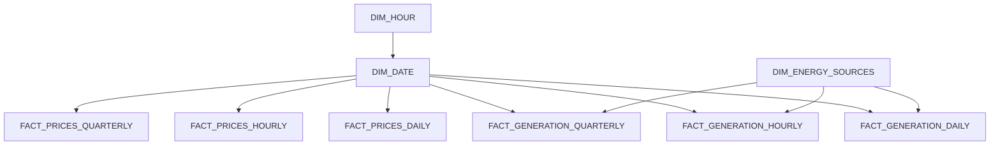

# Energy Markets

## 🔍 Overview

This repository focuses on the current state of energy generation and electricity prices in Germany. It aims to provide data-driven insights into green hydrogen production and its impact on energy sustainability and economic viability. The repository also introduces the **Galaxy Schema** and showcases use cases for **Object Level Security (OLS)** in Power BI.

## 📁 Repository Contents

- **Data**: Historical data on energy generation, consumption patterns, and electricity pricing in Germany.
- **Scripts**: Scripts for data processing or analysis in Python, R, or other languages.
- **Documentation**: Methodologies, data sources, and analytical processes explanations.

## 📊 Power BI Report

Explore the interactive and visual representation of data and findings in our Power BI report.

[🔗 View Power BI Report](https://app.powerbi.com/view?r=eyJrIjoiM2Y1Y2FiNTQtMzg1Zi00NDAwLWFlZTYtMzZjNTIwZmVkYjIxIiwidCI6IjI5ODAzN2JlLTdhZDgtNGM4My04MGYzLTRmMDQ1NGEwY2ZjZCJ9)

## 🎯 Objective

- Analyze trends in energy generation and electricity pricing in Germany.
- Explore green hydrogen as an alternative energy source.
- Provide insights and recommendations for energy sector stakeholders.

## 🛠 Tools and Technologies

- **Data Analysis**: Python, R
- **Visualization**: Power BI
- **Database Management**: SQL, Excel
  
## 🌌 Datamodel: Galaxy Schema

The Galaxy Schema is used for its ability to handle varied data granularities and integrate multiple fact tables with shared dimension tables.

### Comparison with Other Schemas

- **Star Schema**: The star schema is the simplest form of a data warehouse schema. It features a central fact table connected to dimension tables. It's best suited for simple to moderately complex data models. However, it might not be as effective for complex models with multiple layers of hierarchical dimensions.

- **Snowflake Schema**: The snowflake schema is a more normalized version of the star schema. It involves additional layers of dimension tables connected to the primary dimension tables, resembling a snowflake. While it offers more organization and reduces data redundancy, it can become complex and might lead to longer query times.

- **Galaxy Schema (or Fact Constellation Schema)**: The galaxy schema allows multiple fact tables to share dimension tables. It's useful for more complex data models with varied data types and granularities, like my project. This schema provides a flexible and scalable solution for analyzing intricate datasets that are interconnected.

## Power BI Security Features

### Object-Level Security (OLS) in Power BI

Object-Level Security (OLS) in Power BI enables more granular control over data access within the reports. It allows the report designer to secure specific tables or columns within the data model. Users without the necessary permissions won't even know that the secured data exists, as it is completely hidden from their view. OLS is particularly useful in scenarios where a report contains sensitive data that only specific individuals or groups should access.

### Row-Level Security (RLS) in Power BI

Row-Level Security (RLS) in Power BI restricts data access at the row level based on user roles and permissions. With RLS, you can define rules and roles in the Power BI Desktop and then assign users or groups to these roles in the Power BI Service. It ensures that users can only view the data pertinent to them, making it an essential feature for multi-user environments where data privacy and security are paramount.

## Detailed Implementation of Object Level Security (OLS) in Power BI

Object Level Security (OLS) in Power BI is a powerful feature that allows fine-grained control over which users or roles can see certain tables or columns in your data model. This section details the implementation of OLS using Tabular Editor, an external tool that integrates with Power BI for advanced data modeling capabilities.

### Use Case: Security Roles for Different Managerial Levels using Tabular Editor

In this scenario, we have three security roles:
- `Manager_Quarterly`
- `Manager_Hourly`
- `Manager_Daily`

Each role is intended to have access to specific fact tables:
- `Manager_Quarterly` should see data from `FACT_PRICES_QUARTERLY` & `FACT_GENERATION_QUARTERLY`.
- `Manager_Hourly` should see data from `FACT_PRICES_HOURLY` & `FACT_GENERATION_HOURLY`.
- `Manager_Daily` should see data from `FACT_PRICES_DAILY` & `FACT_GENERATION_DAILY`.

### Implementing OLS Using Tabular Editor

The easiest way to implement this in Power BI is through Tabular Editor. Here's a step-by-step guide to setting up OLS for our fact tables:
This is a super simple approach and the goal for this exercise is that  `Manager_Hourly` can only see data derived from the tables `FACT_PRICES_HOURLY` & `FACT_GENERATION_HOURLY`.

1. **Open Power BI Report in Tabular Editor**:
   - In Power BI Desktop, under the ‘External Tools’ ribbon, launch Tabular Editor.

2. **Navigate to Tables in Tabular Editor**:
   - In Tabular Editor, navigate to the Tables section to access the different fact tables.

3. **Set Security for `FACT_GENERATION_QUARTERLY`**:
   - In Tabular Editor, find the `FACT_GENERATION_QUARTERLY` table.
   - Set the security role for `Manager_Hourly` and `Manager_Daily` to 'None', ensuring these roles cannot access this table.
   - Repeat similar steps for other tables and roles as per the requirements.
   - 

4. **Save Changes and Test in Power BI**:
   - After making the changes, save your model and test in Power BI Desktop.
   - Ensure that each role has the appropriate level of access as defined.
   - 

### Best Practices for OLS

- **Test Thoroughly**: Always thoroughly test security settings with different user roles to ensure there are no unintended access permissions.
- **Limitations**: This only applies to data that is accessible within the model and applies to all measures depending on a column. You cannot use this on a single interdependent measure or a manually added value such as target price!!!
- **Keep it Simple**: Aim for simplicity in security models to avoid complex configurations that are hard to maintain.
- **Document Changes**: Keep a record of all changes made for future reference and for team members to understand the security model.

By following these steps, you can effectively implement OLS in Power BI using Tabular Editor, ensuring that each managerial role has access only to the relevant data.

## Advanced Object Level Security (OLS) Implementation Using Calculated Tables
### Context
For complex scenarios where users require access to most columns but certain measures (like price targets or budgets) are sensitive, the straightforward OLS approach may not be sufficient. In such cases, restricting entire tables or columns is impractical. A more sophisticated method involving calculated tables and selective measure visibility is needed.

### Strategy
This method involves creating a hidden calculated table, then applying OLS to it. Consequently, any measure dependent on this table inherits its security restrictions. This approach effectively manages the visibility of sensitive measures without limiting access to the broader dataset.

### Implementation
Objective: Enable user access to daily, hourly, and quarterly prices, while restricting visibility of a global average measure derived from these data points.

### Step 1: Creation of a Calculated Table

Develop a calculated table integral for the sensitive measure, but irrelevant for the general dataset.
Implement OLS on this calculated table to manage access.

### Step 2: Measure Adjustment for OLS

Modify the sensitive measure to depend on the calculated table, thereby linking its visibility to the OLS of the table.

### Step 3: Testing the Security Setup

Conduct tests with various roles, such as 'intern', to verify the effectiveness of the OLS setup.
Users in restricted roles should see all fact table data, except for the specific sensitive measure.

### Conclusion
This approach to implementing OLS in Power BI provides a nuanced way to control data access. It ensures sensitive data remains confidential, while general data remains accessible for broader analytical purposes.

---
Last Updated: 10/01/2024

